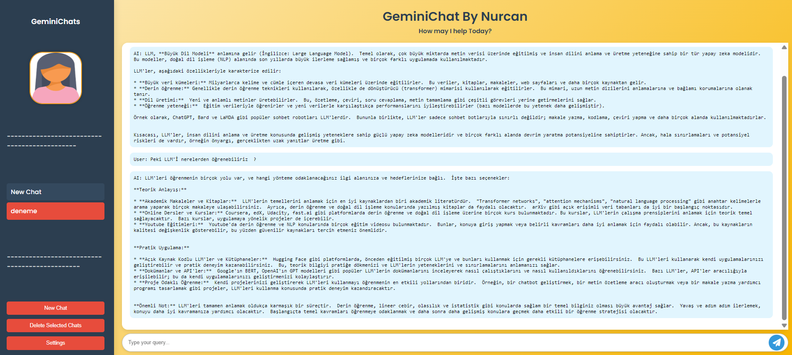
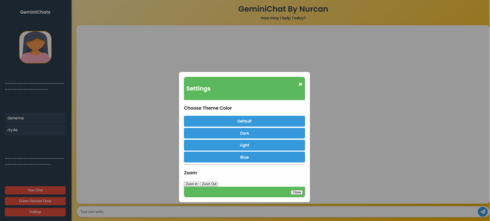

# 🤖 Gemini Chatbot | Yapay Zeka Tabanlı Sohbet Botu  
📘 English | 📗 Türkçe

---

## 📘 English Version

### 🎯 Project Description  
This project is a web-based intelligent chatbot application built using **Google Gemini API** model and **Flask**. It allows users to chat with an AI, manage multiple conversation threads, and receive context-aware responses.

💡 Key functionalities include:
- 🗂️ Chat session management (create/delete)
- 🧠 Contextual memory during conversation
- 🌐 Flask-powered API and frontend
- 🚀 Quick and lightweight, no database needed

---

### ⚙️ Tech Stack  
- **Backend**: Python (Flask)  
- **Frontend**: HTML + Bootstrap 
- **AI Model**: Google Gemini API `google.generativeai`  
- **Extras**: In-memory chat history, RESTful routes

---

### 🚀 How It Works  
1. User visits the web page and selects or creates a chat  
2. Enters a message  
3. The message is sent to Gemini 1.5 via API  
4. The response is displayed below the conversation thread  
5. All messages are stored per session in memory

---

### 📸 Screenshots  
**Chat Interface**  

-   
- 
 
---

### 📂 Project Structure  
```
gemini-chatbot/
│
├── app.py               # Flask backend with Gemini integration
├── templates/
│   ├── index.html       # Main chat interface
├── static/              # (Optional) CSS, JS, or images
└── README.md
```

---

### 🔧 Setup Instructions  
**1. Clone the repository:**
```bash
git clone https://github.com/nurcanyaz/gemini-chatbot.git
cd gemini-chatbot
```

**2. Install dependencies:**
```bash
pip install flask google-generativeai
```

**3. Set your API key in `app.py`:**
```python
os.environ["GOOGLE_API_KEY"] = "your-api-key"
```

**4. Run the application:**
```bash
python app.py
```

Visit 👉 http://127.0.0.1:5000/

---

### 📡 API Endpoints  
| Method | Route          | Description               |
|--------|----------------|---------------------------|
| GET    | `/get_chats`   | Returns all chat sessions |
| GET    | `/get_chat_history?chat_id=ID` | Returns specific chat messages |
| POST   | `/generate`    | Sends user input to Gemini and returns response |
| POST   | `/new_chat`    | Creates a new chat session |
| POST   | `/delete_chat` | Deletes a chat session |

---

### 🧠 Notes  
- Chat history is stored in RAM, so it resets when the server restarts  
- You can integrate a database like SQLite or MongoDB for persistence  
- The front-end is responsive and mobile-friendly  
- Ideal for experimenting with Gemini's conversational abilities


## 📗 Türkçe Versiyonu

### 🎯 Proje Açıklaması  
Bu proje, **Google Gemini API** modeli ile geliştirilen web tabanlı bir sohbet botudur. Kullanıcılar yapay zekayla sohbet edebilir, farklı konuşma oturumları oluşturabilir ve önceki mesajlara göre bağlama duyarlı yanıtlar alabilirler.

🔑 Temel özellikler:
- 🗂️ Çoklu sohbet oturumu yönetimi
- 🧠 Bağlama duyarlı (geçmişi hatırlayan) AI yanıtları
- 🌐 Flask ile geliştirilen backend ve arayüz
- 💾 Hafif ve hızlı kullanım, veritabanı gerektirmez

---

### ⚙️ Kullanılan Teknolojiler  
- **Backend**: Python (Flask)  
- **Frontend**: HTML + Bootstrap  
- **Yapay Zeka**: Google Gemini API (`google.generativeai`)  
- **Ekstra**: Bellekte sohbet kaydı, REST API

---

### 🚀 Nasıl Çalışır?  
1. Kullanıcı sohbet arayüzüne girer  
2. Yeni bir sohbet başlatır veya mevcut sohbete devam eder  
3. Mesajını yazar ve gönderir  
4. Gemini modeli yanıt üretir  
5. Yanıt kullanıcıya sunulur, oturumda saklanır

---

### 📸 Ekran Görselleri  
**Sohbet Arayüzü**  

-   
- 
---

### 📂 Proje Yapısı  
```
gemini-chatbot/
│
├── app.py               # Gemini API ile Flask backend
├── templates/
│   ├── index.html       # Ana sohbet sayfası
├── static/              # (Opsiyonel) CSS, JS, görseller
└── README.md
```

---

### 🔧 Kurulum Adımları  
**1. Reponun kopyalanması:**
```bash
git clone https://github.com/nurcanyaz/gemini-chatbot.git
cd gemini-chatbot
```

**2. Gerekli kütüphanelerin kurulumu:**
```bash
pip install flask google-generativeai
```

**3. API anahtarını `app.py` içinde tanımlayın:**
```python
os.environ["GOOGLE_API_KEY"] = "your-api-key"
```

**4. Uygulamayı başlatın:**
```bash
python app.py
```

Tarayıcıda 👉 http://127.0.0.1:5000 adresini ziyaret edin

---

### 📡 API Uç Noktaları  
| Metod | Adres           | Açıklama                     |
|--------|------------------|-------------------------------|
| GET    | `/get_chats`     | Tüm sohbetleri döndürür       |
| GET    | `/get_chat_history?chat_id=ID` | Seçilen sohbetin geçmişi |
| POST   | `/generate`      | Kullanıcı mesajına yanıt üretir |
| POST   | `/new_chat`      | Yeni sohbet oluşturur         |
| POST   | `/delete_chat`   | Belirtilen sohbeti siler      |

---

### 🧠 Notlar  
- Sohbet geçmişi bellekte tutulur; sunucu kapanırsa silinir  
- Kalıcı kayıt için veritabanı (SQLite, MongoDB vs.) entegre edilebilir  
- Arayüz mobil uyumludur ve kolayca geliştirilebilir  

---

### 👤 Developed by  
**Nurcan Yaz**  
Computer Engineer | AI Researcher 
[LinkedIn](https://www.linkedin.com) • [GitHub](https://github.com)

---
